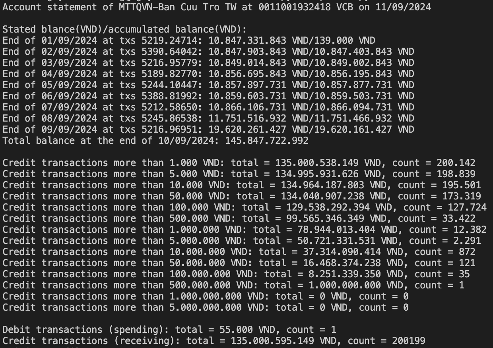

# Tra cứu sao kê (Account Statement Inquiry)

Link: [tra-cuu-sao-ke.vercel.app](https://tra-cuu-sao-ke.vercel.app/)

## Mục tiêu của dự án (Project Purpose)

Ứng dụng này là một ứng dụng serverless Next.js nhằm cung cấp một nền tảng minh bạch và toàn diện nhất để tra cứu các bản sao kê quyên góp từ thiện của các đơn vị tổ chức tại Việt Nam. Điều này xuất phát từ thực tế trong quá khứ, như đợt lũ lụt ở miền Trung năm 2020 và dịch Covid-19, nhiều quỹ và cá nhân thực hiện kêu gọi quyên góp đã xảy ra tình trạng thiếu minh bạch, lạm dụng, lừa đảo, và chiếm đoạt tài sản, gây thất thoát và gây khó khăn cho việc kiểm soát tiến trình từ thiện. Tất cả là vì thông tin không được công khai và giám sát một cách minh bạch.

---

This is a serverless Next.js app designed to provide the most transparent and comprehensive platform for checking donation statements from charitable organizations in Vietnam. This arises from past situations, such as the Central Vietnam floods in 2020 and the Covid-19 pandemic, where many funds and individuals calling for donations encountered issues of a lack of transparency, abuse, fraud, and embezzlement, leading to losses and making it difficult to monitor charitable processes. All of this happened because information was not made public and transparently monitored.

## Động lực phát triển (Motivation)

Gần đây, bão Yagi cùng với các hiện tượng thiên tai như lũ lụt, lũ quét và sạt lở đất vào tháng 9 năm 2024 đã gây ra thiệt hại nặng nề cho miền Bắc Việt Nam. Hàng trăm người đã mất mạng, cơ sở hạ tầng bị phá hủy nghiêm trọng, và việc tái thiết lại cơ sở hạ tầng cùng cuộc sống của người dân cần sự chung tay của cả quốc gia. Quá trình quyên góp từ thiện là điều không thể thiếu.

Vào ngày 12 tháng 9 năm 2024, Mặt trận Tổ quốc Việt Nam (MTTQVN) đã công bố bản sao kê chi tiết cho các khoản quyên góp vào tài khoản "MTTQVN-Ban Cứu Trợ TW" số 0011001932418 tại ngân hàng VCB vào ngày 11/09/2024, với tổng số tiền quyên góp từ ngày 01/09/2024 đến ngày 10/09/2024 đạt 135 tỷ VNĐ. Tính đến ngày 13/09/2024, tổng số tiền quyên góp vào MTTQ VN đã vượt qua 500 tỷ VNĐ. Những khoản quyên góp lớn như vậy càng nhấn mạnh tầm quan trọng của việc minh bạch trong quản lý thu chi để ngăn chặn gian lận và tham nhũng.

Đây không chỉ là một yêu cầu hiện tại mà còn là xu hướng tất yếu trong tương lai. Với sự gia tăng của các sự kiện thiên tai và các cuộc khủng hoảng xã hội, việc minh bạch trong quyên góp sẽ ngày càng trở nên quan trọng hơn. Chúng ta sẽ cần nhiều hơn nữa các bản sao kê chi tiết và cơ chế giám sát để đảm bảo rằng các nguồn lực được sử dụng một cách hiệu quả và chính xác. Đó chính là lý do mà dự án này ra đời và là động lực chính để thúc đẩy sự minh bạch trong hoạt động từ thiện tại Việt Nam.

---

Recently, Typhoon Yagi, along with natural disasters such as floods, flash floods, and landslides in September 2024, has caused severe damage to Northern Vietnam. Hundreds of people have lost their lives, infrastructure has been critically destroyed, and the reconstruction of infrastructure and people’s lives requires nationwide effort. The process of charitable donations is essential.

On September 12, 2024, the Vietnam Fatherland Front released (MTTQVN) a detailed statement for donations to the account `MTTQVN-Ban Cuu Tro TW` number `0011001932418` at VCB bank as of September 11, 2024, with a total donation amount of 135 billion VND from September 1, 2024, to September 10, 2024. As of September 13, 2024, the total donations to MTTQVN have exceeded 500 billion VND. Such large donations highlight the importance of transparency in managing financial transactions to prevent fraud and corruption.

This is not only a current necessity but also an inevitable trend for the future. With the increasing frequency of natural disasters and social crises, transparency in donations will become even more crucial. We will need more detailed statements and monitoring mechanisms to ensure that resources are used effectively and accurately. This is the reason for the inception of this project and the primary motivation for promoting transparency in charitable activities in Vietnam.

## Đóng góp của dự án (Project Contributions)

- Thứ nhất, tôi đã chuyển đổi bản sao kê pdf dài 12,000 trang thành 25 file csv (mỗi file khoảng 1MB) lưu trữ chi tiết thông tin về các giao dịch, mỗi giao dịch bao gồm: Ngày giao dịch (TNXDate), Số chứng từ (DocNo), Chi (Debit), Thu (Credit), Số dư (Balance - giao dịch cuối cùng của mỗi ngày sẽ có tổng kết số dư), Mô tả (Transactions in Detail). Hiện tại các dự án tra cứu dữ liệu sao kê chưa tách biệt được khoản thu/chi và số dư, do đó bộ dữ liệu này sẽ giúp mọi người có thông tin để xây dựng hệ thống tra cứu tốt hơn.
- Thứ hai, tôi cũng đã xây dựng một website tra cứu trên tập dữ liệu sao kê này bằng NextJS, ứng dụng có tốc độ tra cứu khá nhanh, đáp ứng đủ nhu cầu sử dụng của mọi người mà không lo về nguy cơ bị tắc nghẽn.

- First, I have converted a 12,000-page PDF statement into 25 CSV files (each about 1MB) that store detailed information about transactions. Each transaction includes: Transaction Date (TNXDate), Document Number (DocNo), Debit, Credit, Balance (the final balance of each day’s transactions), and Description (Transactions in Detail). Currently, existing data inquiry projects have not separated income/expenses and balance, so this dataset will help people build better query systems.
- Second, I have also developed a NextJS website for querying this statement dataset. The application provides relatively fast query speeds, meeting users' needs without worrying about potential congestion.

## Kế hoạch sắp tới (Upcoming Plans)

- Số hoá các bản sao kê, VD các bản sao kê trên giấy của các nghệ sĩ
- Thiết kế và nâng cấp hệ thống để phục vụ chịu tải tốt hơn và nhiều dữ liệu hơn
- Tối ưu trải nghiệm người dùng

---

- Digitize more statements, e.g., paper statements from artists
- Design and upgrade the system to handle better load and more data
- Optimize user experience

## Tham gia đóng góp (How to Contribute)

Chúng tôi rất hoan nghênh mọi người đóng góp vào dự án. Bạn có thể tham gia bằng cách:

- Xây dựng và phát triển dataset sao kê từ thiện.
- Đóng góp mã nguồn bằng cách tạo Pull request trên GitHub.
- Đề xuất tính năng mới hoặc báo lỗi.

We welcome contributions from everyone. You can participate by:

- Building and enhancing the charity statement dataset.
- Contributing to the codebase by submitting Pull requests on GitHub.
- Proposing new features or reporting bugs.

## Cài đặt (Installation)

1. Fork repo
2. Use `bun` to install dependencies
3. Create pull request and wait for approval

## Liên hệ (Contact)

Nếu bạn có bất kỳ câu hỏi hoặc đề xuất nào, vui lòng liên hệ với chúng tôi Linkedin: [Chung Nguyen](https://www.linkedin.com/in/galin-chung-nguyen)

If you have any questions or suggestions, feel free to contact us via Linkedin: [Chung Nguyen](https://www.linkedin.com/in/galin-chung-nguyen)
